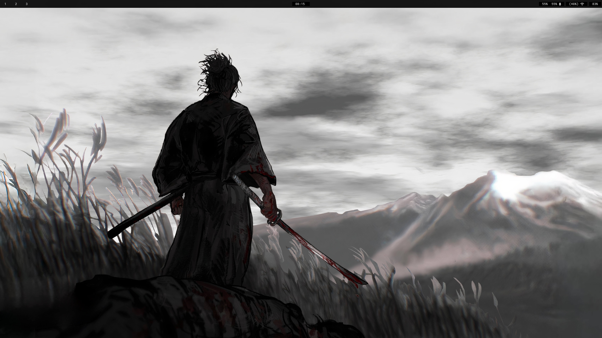
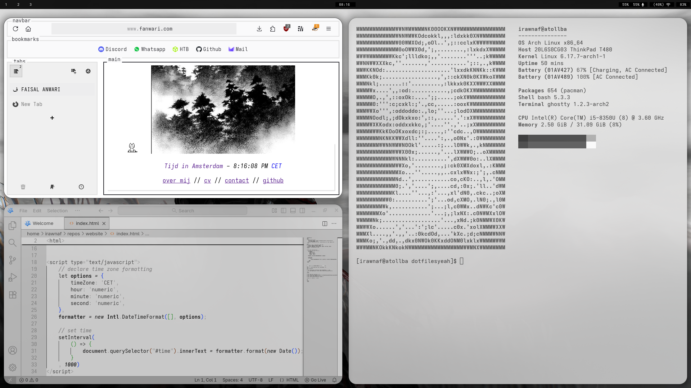
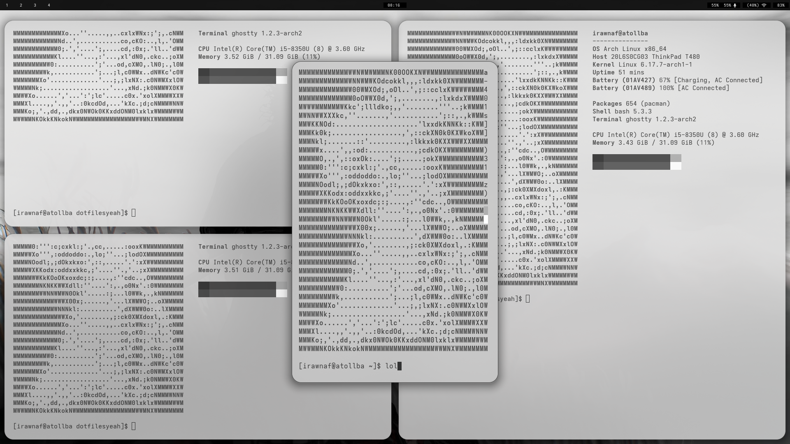
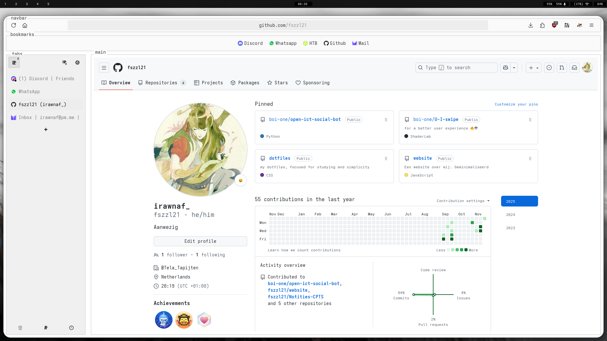

# Irawnaf's Dotfiles.

This contains my Linux Hyprland Dotfiles made for Arch. I made it so i can focus on school without feeling to go to r/unixporn all the time to switch and waste time. This is purely for effeciency and not being bombarded with dopamine hits.

It is lightweight as it is using around 1-3 GB RAM on daily usage.

> [!WARNING] 
>  
> I am not a expert with Dotfiles as so i don't know if i have imported al the needed files. It is also recommended to put it on a fresh install as that is my way for using someone else's dots. I also have not tested the dots on different OS's but it should not be a problem.
> 

## Showcase

## Install

1. Install Hyprland via AUR helper
2. Install the following applications: Helix, Yazi, Fastfetch, Wofi, Waybar, Hyprlock, Alacritty, Ghostty, Librewolf, greetd, tuigreet.
3. Git clone the repo and put it in the `/home/.config` folder.
4. Reboot, and then i hope its done??

## Keybinds

> [!Tip]
> This isnt every Keybind. Just some highlighted ones.
> 
> More can be found and changed in `~/.config/hypr/hyprland.conf`

`L_CTRL + L_ALT + Q` = Shutdown

`Mod + T` = Open main terminal

`Mod + Y` = Open mini terminal

`Mod + B` = Open browser (I have set the browser on librewolf)

`Mod + L` = Lock the PC

`Mod + L_Shift + [Number]` = Move application to screen 1-9

`Mod + W` = Open application search/wofi 

## Where is the startup screen? 

Download Greetd and [Tui_greet](https://github.com/apognu/tuigreet) via AUR helper and use the wiki to config that.

## What is your VSC theme? 

sjsepan.newspaperish on VSC Extensions

